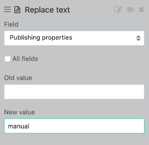

This custom view will help you create on overview of all the datasets on your domain. See the [user guide](https://help.opendatasoft.com/platform/fr/publishing_data/04_configuring_a_source/connectors/dataset_of_datasets.html#creation) to set up this special dataset.

For this view to properly function, you need to set-up the following fields as facets:
- Dataset ID
- Publishing Properties,
- Themes (multivalued)
- Producer,
- License,
- Visibility

You also need to setup a *Relpace text* processor with the field *Publishing Properties* and new value set to *"manual"*:

