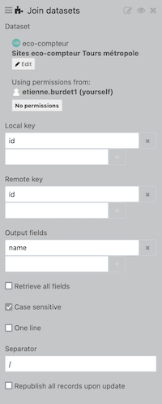

This custom view is a plug and play add-on for data from the eco-counter extractor. You will need to up set up two datasets (either via URL or file upload), with the following configuration:

- Eco-counter sites: with **eco-counter-sites** as source type (which will do automatically sort and format everything).
- Eco-counter data: with **eco-counter** as source type and `hour` as timestep in the options. Then add a join processor with the _eco-counter-sites_ dataset with `id` as local and remote key and `name` as return field. 

The view can then be copy-pasted in your [visualization tab](https://help.opendatasoft.com/platform/en/publishing_data/07_configuring_visualizations/06_configuring_custom_view/custom.html#configuring-the-custom-view).
